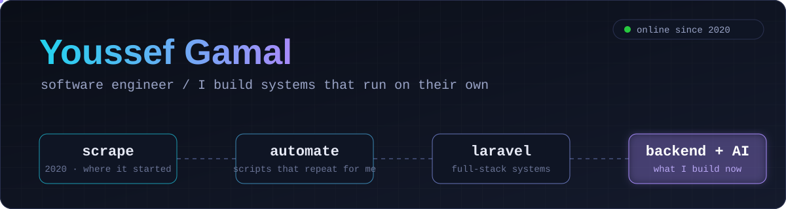

<div align="center">



<br/>

### `Youssef Gamal`

**Software Engineer · Open-Source Developer · Backend & AI**

Building software that works quietly, solves real problems, and does not need to be babysat.

<br/>

[](https://github.com/Youssef-Mekkkawy)
[](https://www.linkedin.com/in/youssef-gamal-m-494865146/)
[](mailto:youssef.mekkawy2020@gmail.com)

</div>

---

## `/about`

```text
NAME        Youssef Gamal
ROLE        Software Engineer
FOCUS       Backend systems, automation, AI integration
STARTED     Programming in 2020
BUILDING    Software, open-source tools, and systems that automate work
```

I am a Software Engineer who enjoys turning repetitive, complicated work into systems that can handle it on their own.

My main focus is **Python, Laravel, FastAPI, backend development, automation, web scraping, data workflows, and AI integration**.

I also work with C++, Linux, Git, MySQL, MongoDB, PostgreSQL, Docker, and Vue.js.

I care less about making software look impressive in a demo and more about making it **useful, maintainable, testable, and reliable in real use**.

---

## `/story`

I started programming in **2020**, coming from a Mechatronics background.

My first real project was **web scraping**.

I liked the idea that a computer could take a repetitive task that normally required hours of manual work and simply do it automatically.

That idea stayed with me.

From scraping, I moved deeper into **automation**, then into **full-stack development with Laravel**, and eventually into backend systems, data processing, and AI-powered software.

Today, I combine that background with my Computer Science studies at **SUT**, freelance development, and building software independently through my own company.

The technology has changed over time, but the question has stayed almost the same:

> **Why are we doing this manually when software could do it for us?**

---

## `/how-i-think`

```python
class Youssef:
    enjoys = [
        "automation",
        "backend systems",
        "data",
        "AI integration",
        "building useful tools",
    ]

    avoids = [
        "silent failures",
        "unmaintainable code",
        "works-on-my-machine software",
        "unnecessary complexity",
    ]

    principles = [
        "design before coding",
        "test important behavior",
        "automate repetitive work",
        "keep systems understandable",
        "build for real use",
    ]
```

I like software that keeps working when nobody is watching it.

---

## `/opensource`

Open source is a big part of what I enjoy building.

I like creating tools that solve problems I personally encounter, then turning those tools into software that other developers can use, modify, and build on.

A lot of my open-source work is focused around **automation, developer tooling, REST APIs, and making repetitive work easier**.

```text
BUILD SOMETHING
      ↓
MAKE IT REUSABLE
      ↓
TEST IT
      ↓
DOCUMENT IT
      ↓
OPEN IT
      ↓
LET OTHERS USE IT
```

### Featured

| Project | Description | Stack |
|---|---|---|
| [Islam Mate API](https://github.com/Youssef-Mekkkawy/islam-mate-api) | Open-source Islamic REST API — Prayer times, Hadith, Azkar, Quran, Qibla | Python · FastAPI |
| [Laravel AI Translator](https://github.com/Youssef-Mekkkawy/laravel-ai-translator) | AI-powered translation package for Laravel applications | PHP · Laravel |

→ **Explore all repositories:** https://github.com/Youssef-Mekkkawy?tab=repositories

---

## `/stack`

### Core

<p>


</p>

### Backend

<p>


</p>

### Data & Automation

<p>


</p>

### Databases & Infrastructure

<p>


</p>

### Frontend

<p>


</p>

---

## `/projects`

```text
┌────────────────────────────────────────────┐
│ BACKEND                                    │
│ APIs · services · application architecture │
├────────────────────────────────────────────┤
│ AUTOMATION                                 │
│ scraping · pipelines · repetitive tasks    │
├────────────────────────────────────────────┤
│ AI                                         │
│ LLMs · intelligent tools · integrations    │
├────────────────────────────────────────────┤
│ SOFTWARE TOOLS                             │
│ developer utilities · open-source projects │
└────────────────────────────────────────────┘
```

---

## `/now`

```text
→ studying Computer Science at SUT
→ building backend systems and REST APIs
→ developing open-source Islamic developer tools
→ experimenting with AI-powered software
→ freelance full-stack development
```

---

## `/outside-code`

There is more to me than code.

I am a **big gaming fan**, especially when a game gives me a world worth exploring.

```text
COMPETITIVE       VALORANT · Rainbow Six Siege
OPEN WORLD        GTA V · Assassin's Creed · Far Cry
```

I also love **building PCs** — choosing the hardware, putting everything together, and learning why it works the way it does.

---

## `/engineering-rules`

```text
01  Understand the problem before choosing the technology.
02  Design the structure before writing too much code.
03  Automate repetitive work whenever it makes sense.
04  Test behavior that matters.
05  Prefer simple systems that are easy to understand.
06  Do not build only for the demo.
07  Make software that another developer can maintain.
08  Learn by building, not only by reading.
09  When something can fail, think about how it fails.
10  Keep improving.
```

---

## `/education`

**AASTMT** — Mechatronics · Diploma with Honors

**SUT** — Computer Science · Current

---

## `/contact`

**software engineering · backend systems · AI · automation · open source · REST APIs · Python · Laravel · FastAPI**

```text
GitHub    → https://github.com/Youssef-Mekkkawy
LinkedIn  → https://www.linkedin.com/in/youssef-gamal-m-494865146/
Email     → youssef.mekkawy2020@gmail.com
```

<div align="center">

<br/>

```text
build it
automate it
understand it
share it
```

<sub>Thanks for stopping by.</sub>

</div>